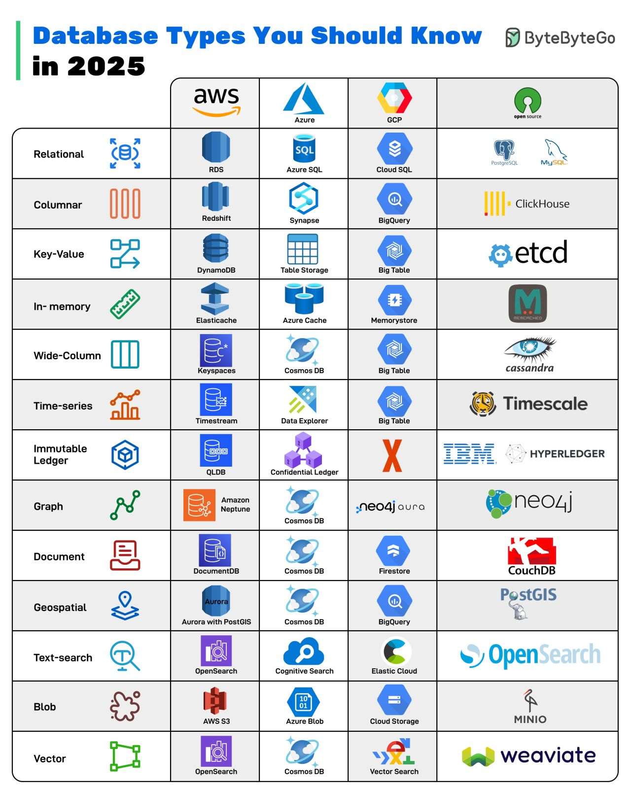

# 💾 Database Selection Guide

When building a modern application, choosing the right database (or combination of databases) is crucial. Different databases excel in different areas:

* **PostgreSQL / MySQL**
    * → **Best for transactional, structured data.** These are the workhorses for applications requiring strong consistency, complex joins, and reliability (ACID properties).
* **MongoDB / Couchbase**
    * → **Great for flexible document storage.** Ideal for content management, catalogs, or data models that evolve quickly (schemaless).
* **Redis**
    * → **Ideal for caching, sessions, and ultra-fast reads.** Primarily used as an in-memory data structure store for speed-critical operations.
* **Cassandra / ScyllaDB**
    * → **Perfect for massive, distributed workloads.** Designed for high availability and linear scalability across many nodes, often used for big data and write-heavy systems.
* **Neo4j**
    * → **When relationships matter more than rows.** A specialized graph database for analyzing complex connections, such as social networks or recommendation engines. 
* **InfluxDB / TimescaleDB**
    * → **Built for time-series & metric-heavy applications.** Optimized for storing and querying data that changes over time, like sensor readings or application metrics.

---

### 💡 Modern Strategy

> Modern applications often combine **2–4 databases** to get the perfect balance of **performance, scalability, and reliability** (e.g., using PostgreSQL for core data, Redis for caching, and MongoDB for user profiles).

---

# Database types

* **Relational**
    * → **Best for transactional, structured data.** Traditional row-and-column databases ideal for strong consistency, complex joins, and ACID-compliant workloads.

* **Columnar**
    * → **Best for analytical workloads.** Stores data by columns to enable fast aggregations and efficient scans over large datasets.

* **Key-Value**
    * → **Best for ultra-fast lookups.** Simple key–value storage optimized for speed, commonly used for caching and session data.

* **In-memory**
    * → **Best for low-latency access.** Keeps data in RAM for microsecond-level responses, ideal for caching, queues, and real-time use cases.

* **Wide-Column**
    * → **Best for large-scale, distributed data.** Designed to handle massive volumes of semi-structured data across many nodes.

* **Time-series**
    * → **Best for time-based data.** Optimized for metrics, logs, and sensor data where time is the primary dimension.

* **Immutable Ledger**
    * → **Best for tamper-proof records.** Provides cryptographically verifiable, append-only transaction logs for audit and compliance use cases.

* **Graph**
    * → **Best for relationship-heavy data.** Excels at modeling complex relationships, such as social networks, recommendations, and fraud detection.

* **Document**
    * → **Best for flexible schemas.** JSON-like document storage suited for modern applications with frequently evolving data models.

* **Geospatial**
    * → **Best for location-aware data.** Supports spatial queries, maps, routing, and geographic analytics.

* **Text-search**
    * → **Best for full-text search.** Enables indexing, ranking, filtering, and analytics over large volumes of text.

* **Blob**
    * → **Best for unstructured objects.** Stores large binary files such as images, videos, backups, and documents.

* **Vector**
    * → **Best for AI/ML similarity search.** Designed for working with embeddings to power recommendations, semantic search, and AI-driven applications.
