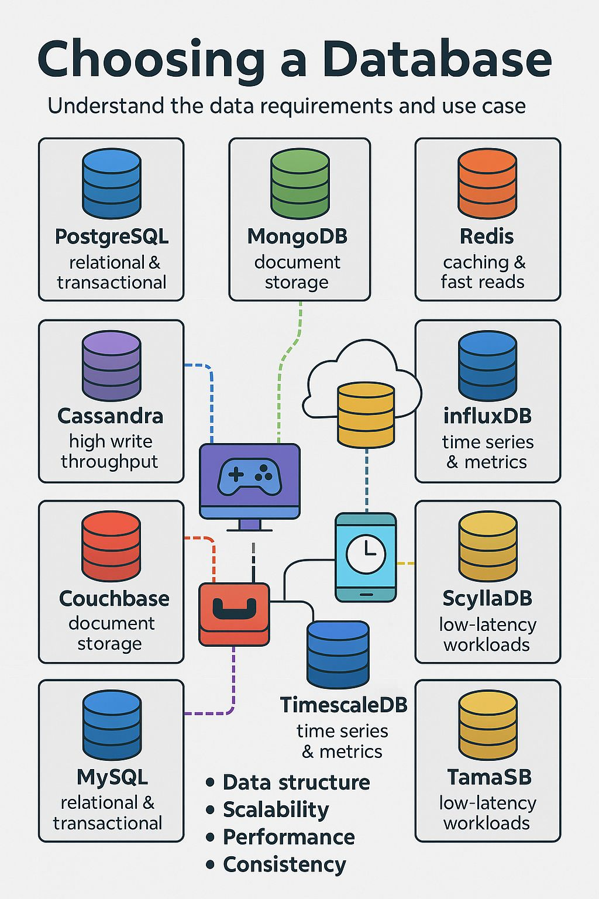

# 💾 Database Selection Guide

When building a modern application, choosing the right database (or combination of databases) is crucial. Different databases excel in different areas:

* **PostgreSQL / MySQL**
    * → **Best for transactional, structured data.** These are the workhorses for applications requiring strong consistency, complex joins, and reliability (ACID properties).
* **MongoDB / Couchbase**
    * → **Great for flexible document storage.** Ideal for content management, catalogs, or data models that evolve quickly (schemaless).
* **Redis**
    * → **Ideal for caching, sessions, and ultra-fast reads.** Primarily used as an in-memory data structure store for speed-critical operations.
* **Cassandra / ScyllaDB**
    * → **Perfect for massive, distributed workloads.** Designed for high availability and linear scalability across many nodes, often used for big data and write-heavy systems.
* **Neo4j**
    * → **When relationships matter more than rows.** A specialized graph database for analyzing complex connections, such as social networks or recommendation engines. 
* **InfluxDB / TimescaleDB**
    * → **Built for time-series & metric-heavy applications.** Optimized for storing and querying data that changes over time, like sensor readings or application metrics.

---

### 💡 Modern Strategy

> Modern applications often combine **2–4 databases** to get the perfect balance of **performance, scalability, and reliability** (e.g., using PostgreSQL for core data, Redis for caching, and MongoDB for user profiles).