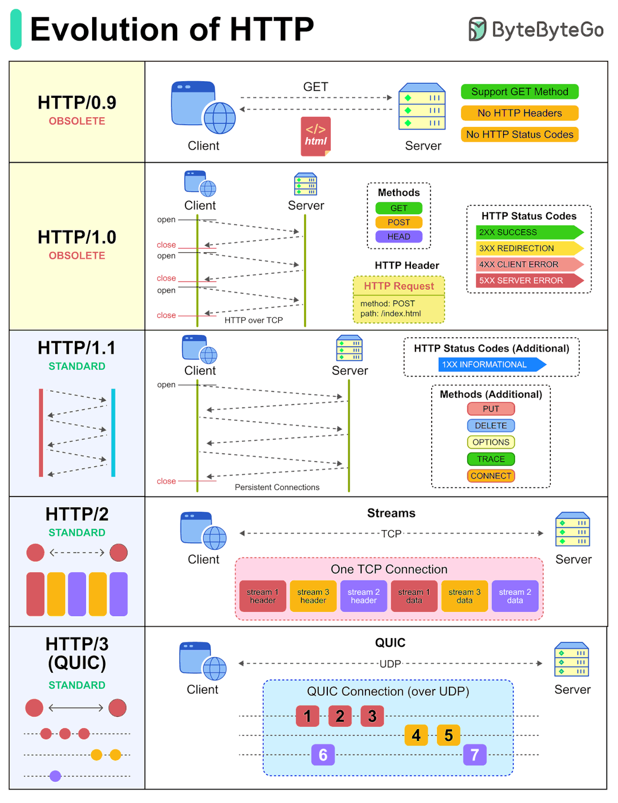

## HTTP/0.9 (1991) — The Original

* **Single-line request**
    * → Only GET method supported. No headers, no status codes, no versioning.

* **Response format**
    * → HTML only. Connection closes after response.

* **Limitations**
    * → No metadata, no error handling, no content types. Extremely basic.

* **Status**
    * → Obsolete. Historical reference only.

## HTTP/1.0 (1996) — First Standardization

* **Request/Response headers**
    * → Introduced headers for metadata (Content-Type, Content-Length, etc.).

* **Status codes**
    * → Added status codes (200, 404, etc.) for better error handling.

* **Multiple methods**
    * → Expanded beyond GET to include POST, HEAD.

* **Content negotiation**
    * → Support for different content types and encodings.

* **Connection model**
    * → One request per connection. Connection closes after each request.

* **Limitations**
    * → No persistent connections, no pipelining, inefficient for multiple resources.

## HTTP/1.1 (1997) — The Workhorse

* **Persistent connections**
    * → Keep-alive connections by default. Reuse connections for multiple requests.

* **Pipelining**
    * → Send multiple requests without waiting for responses (limited adoption due to head-of-line blocking).

* **Chunked transfer encoding**
    * → Stream data without knowing content length upfront.

* **Host header**
    * → Required header enabling virtual hosting (multiple domains on one server).

* **Caching improvements**
    * → Enhanced cache control headers (ETag, Cache-Control, Vary).

* **Range requests**
    * → Support for partial content requests (206 Partial Content).

* **Status**
    * → Most widely used version today. Still the default for most web traffic.

## HTTP/2 (2015) — Performance Revolution

* **Multiplexing**
    * → Multiple requests/responses over a single connection simultaneously. Solves head-of-line blocking.

* **Header compression**
    * → HPACK compression reduces header overhead significantly.

* **Server push**
    * → Server can proactively send resources before client requests them.

* **Binary protocol**
    * → More efficient than text-based HTTP/1.x. Frames instead of plain text.

* **Stream prioritization**
    * → Clients can prioritize which resources to load first.

* **Backward compatible**
    * → Same semantics as HTTP/1.1, just faster transport.

* **Requirements**
    * → Requires HTTPS (TLS) in practice. Most browsers enforce this.

## HTTP/3 (2022) — QUIC-Based

* **QUIC transport**
    * → Built on UDP instead of TCP. Reduces connection establishment time.

* **Built-in encryption**
    * → TLS 1.3 encryption is mandatory, not optional.

* **Connection migration**
    * → Maintains connection when switching networks (WiFi to cellular).

* **Improved multiplexing**
    * → No head-of-line blocking at transport level. Independent streams.

* **Faster handshakes**
    * → 0-RTT and 1-RTT connection establishment (vs 3-RTT for TCP+TLS).

* **Better for mobile**
    * → Handles network changes and packet loss more gracefully.

* **Status**
    * → Growing adoption. Supported by major browsers and CDNs.

## 📊 Version Comparison

| Version | Year | Transport | Multiplexing | Encryption | Key Feature |
|---------|------|-----------|--------------|------------|-------------|
| 0.9     | 1991 | TCP       | ❌ No        | ❌ No      | Single-line GET |
| 1.0     | 1996 | TCP       | ❌ No        | ⚠️ Optional | Headers & status codes |
| 1.1     | 1997 | TCP       | ⚠️ Limited   | ⚠️ Optional | Persistent connections |
| 2       | 2015 | TCP       | ✅ Yes       | ⚠️ Required* | Multiplexing & compression |
| 3       | 2022 | UDP/QUIC  | ✅ Yes       | ✅ Required | QUIC transport & 0-RTT |

\* *HTTP/2 requires TLS in practice (most browsers enforce HTTPS)*

## 💡 When to Use Which Version

* **HTTP/1.1**
    * → Default choice. Works everywhere. Use for simple APIs, legacy systems.

* **HTTP/2**
    * → Modern web applications. Benefits from multiple resources, multiplexing. Requires HTTPS.

* **HTTP/3**
    * → Cutting-edge applications. Best for mobile, high-latency networks, real-time apps. Growing support.

