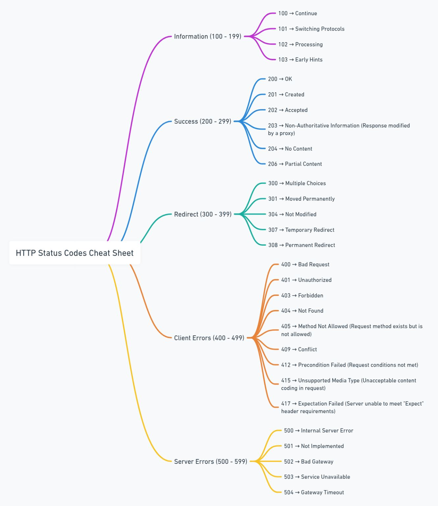

## 📘 Information (100–199) — Request Acknowledgment

* **100 – Continue**
    * → **Request headers received.** The client should continue by sending the request body.

* **101 – Switching Protocols**
    * → **Protocol change in progress.** The server is switching protocols as requested (e.g., HTTP → WebSockets).

* **102 – Processing**
    * → **Request is still being processed.** No final response is available yet.

* **103 – Early Hints**
    * → **Resource preloading optimization.** Allows the client to preload assets before the final response.

## ✅ Success (200–299) — Request Successfully Processed

* **200 – OK**
    * → **Request successful.** The response contains the requested data.

* **201 – Created**
    * → **Resource successfully created.** Commonly returned after POST or PUT requests.

* **202 – Accepted**
    * → **Request accepted for processing.** Processing is asynchronous and not yet complete.

* **203 – Non-Authoritative Information**
    * → **Response modified by a proxy.** The data is not directly from the origin server.

* **204 – No Content**
    * → **Request successful with no response body.** Often used for DELETE operations.

* **206 – Partial Content**
    * → **Partial response delivered.** Used with range requests (e.g., video streaming).

## 🔄 Redirect (300–399) — Further Action Required

* **300 – Multiple Choices**
    * → **Multiple representations available.** The client must select one.

* **301 – Moved Permanently**
    * → **Permanent URL change.** Future requests should use the new URL.

* **304 – Not Modified**
    * → **Cached version is valid.** No need to resend the resource.

* **307 – Temporary Redirect**
    * → **Temporary URL change.** The HTTP method must remain unchanged.

* **308 – Permanent Redirect**
    * → **Permanent redirect with method preservation.** Similar to 301 but stricter.

## 🚫 Client Errors (400–499) — Client-Side Issues

* **400 – Bad Request**
    * → **Invalid request syntax or parameters.**

* **401 – Unauthorized**
    * → **Authentication required or failed.**

* **403 – Forbidden**
    * → **Access denied.** Authentication alone is not sufficient.

* **404 – Not Found**
    * → **Resource does not exist.**

* **405 – Method Not Allowed**
    * → **HTTP method not supported** for the requested resource.

* **409 – Conflict**
    * → **State conflict detected.** Often occurs with concurrent updates.

* **412 – Precondition Failed**
    * → **Request preconditions not met.** Common with conditional headers.

* **415 – Unsupported Media Type**
    * → **Request format not supported** by the server.

* **417 – Expectation Failed**
    * → **Server cannot satisfy the `Expect` header.**

## 💥 Server Errors (500–599) — Server-Side Failures

* **500 – Internal Server Error**
    * → **Unexpected server failure.** Generic error without specific details.

* **501 – Not Implemented**
    * → **Method not supported** by the server.

* **502 – Bad Gateway**
    * → **Invalid response from upstream server.**

* **503 – Service Unavailable**
    * → **Server temporarily unavailable.** Often due to overload or maintenance.

* **504 – Gateway Timeout**
    * → **Upstream server failed to respond in time.**
