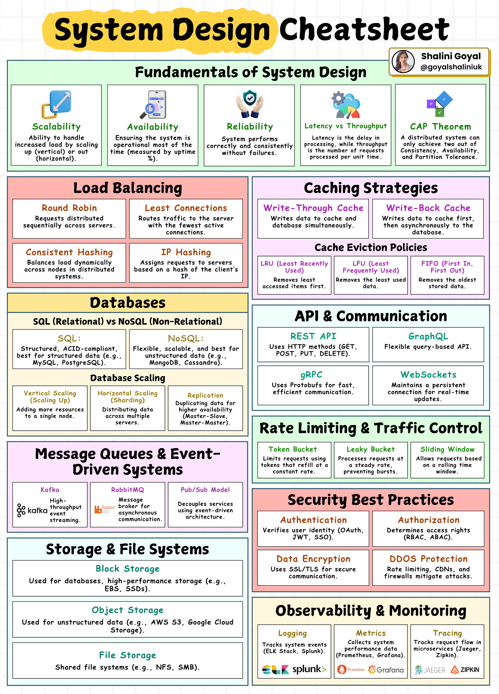

# Top 20 System Design Concepts You Should Know

---

* **Load Balancing**
    * → **Distributes traffic across multiple servers.** Improves reliability, availability, and fault tolerance.

* **Caching**
    * → **Stores frequently accessed data in memory.** Reduces latency and load on backend systems.

* **Database Sharding**
    * → **Splits databases horizontally.** Enables systems to handle large-scale data growth.

* **Replication**
    * → **Copies data across multiple replicas.** Improves availability and fault tolerance.

* **CAP Theorem**
    * → **Trade-off between Consistency, Availability, and Partition Tolerance.** A core principle in distributed systems.

* **Consistent Hashing**
    * → **Evenly distributes data and traffic across nodes.** Minimizes rebalancing when nodes are added or removed.

* **Message Queues**
    * → **Decouples services using asynchronous communication.** Improves scalability and resilience.

* **Rate Limiting**
    * → **Controls request frequency.** Protects systems from abuse and overload.

* **API Gateway**
    * → **Centralized entry point for APIs.** Handles routing, authentication, and throttling.

* **Microservices**
    * → **Breaks systems into independent services.** Enables faster development and independent scaling.

* **Service Discovery**
    * → **Dynamically locates services.** Essential for distributed and microservice-based systems.

* **CDNs**
    * → **Delivers content from edge servers.** Improves performance and reduces latency.

* **DB Indexing**
    * → **Speeds up database queries.** Uses indexes on frequently queried fields.

* **Partitioning**
    * → **Divides data across nodes.** Improves scalability and performance.

* **Eventual Consistency**
    * → **Ensures data consistency over time.** Common in distributed databases.

* **WebSockets**
    * → **Enables bidirectional communication.** Ideal for real-time updates.

* **Scalability**
    * → **Increases system capacity.** Achieved by adding or upgrading machines.

* **Fault Tolerance**
    * → **Keeps systems running during failures.** Handles hardware and software issues gracefully.

* **Monitoring**
    * → **Tracks metrics, logs, and alerts.** Helps understand and maintain system health.

* **AuthN & AuthZ**
    * → **Authentication and Authorization.** Verifies identity and controls access securely.

---

